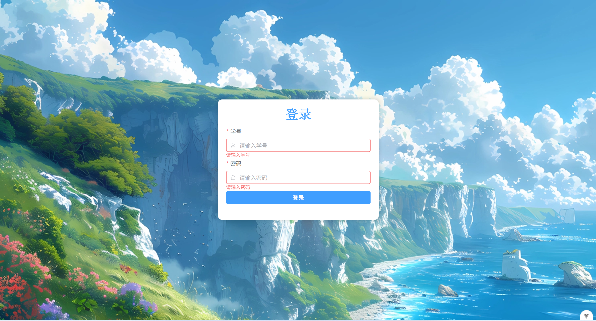
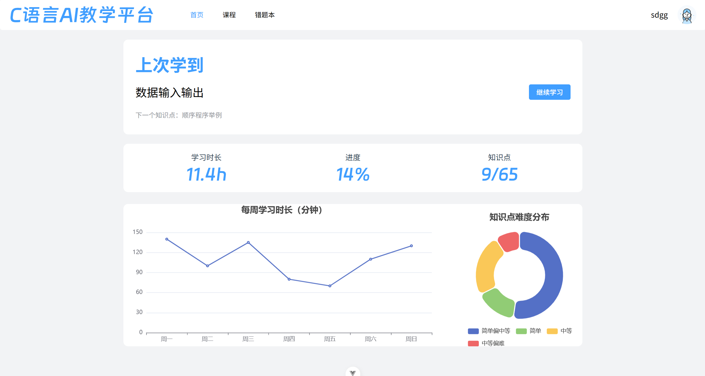
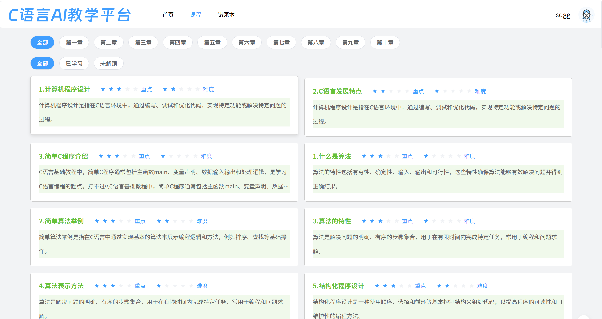
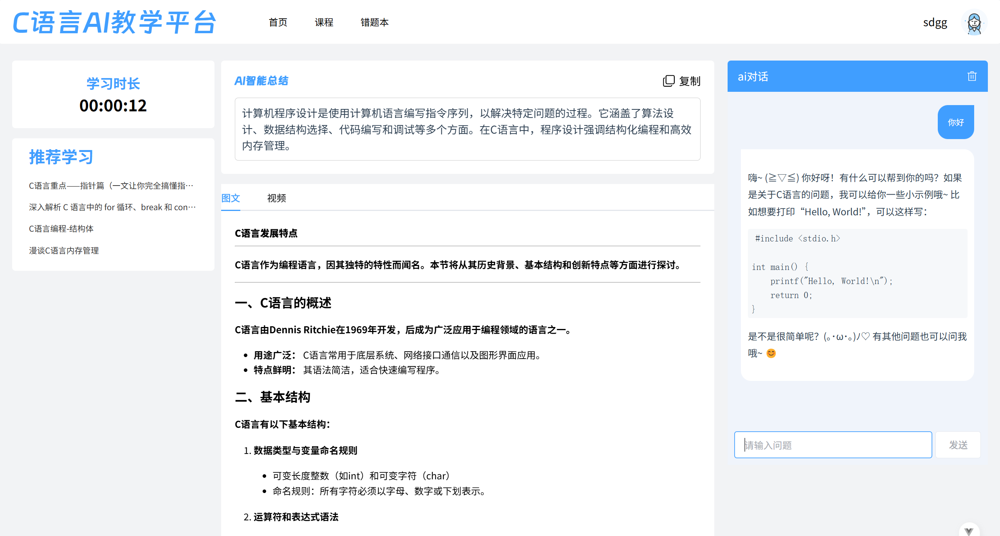
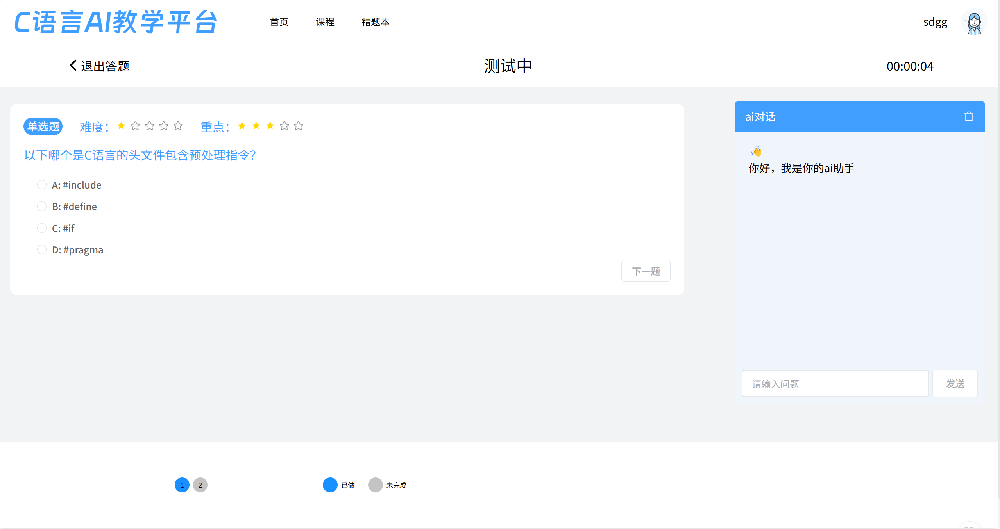
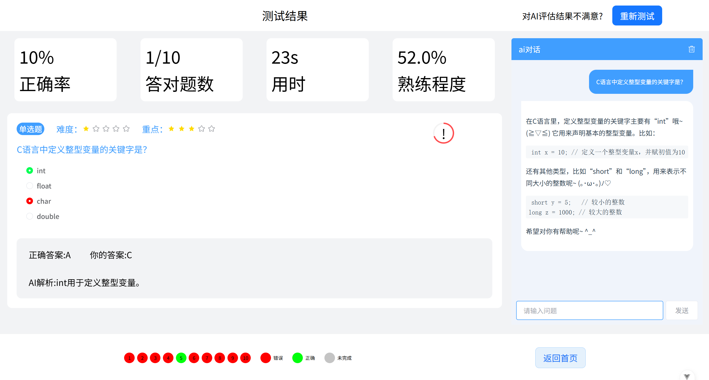
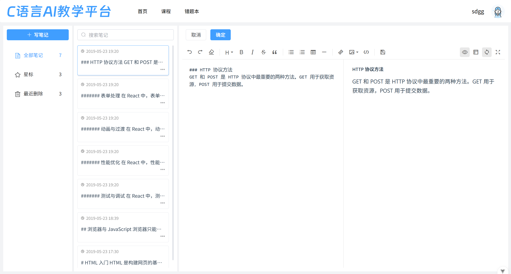
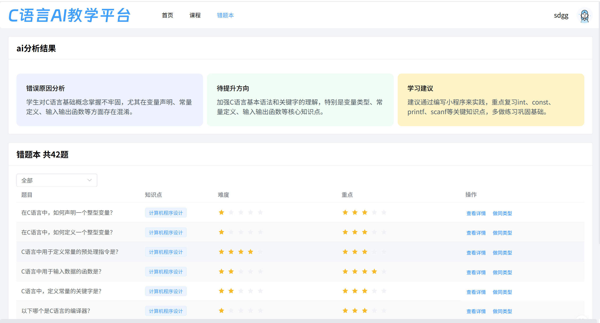
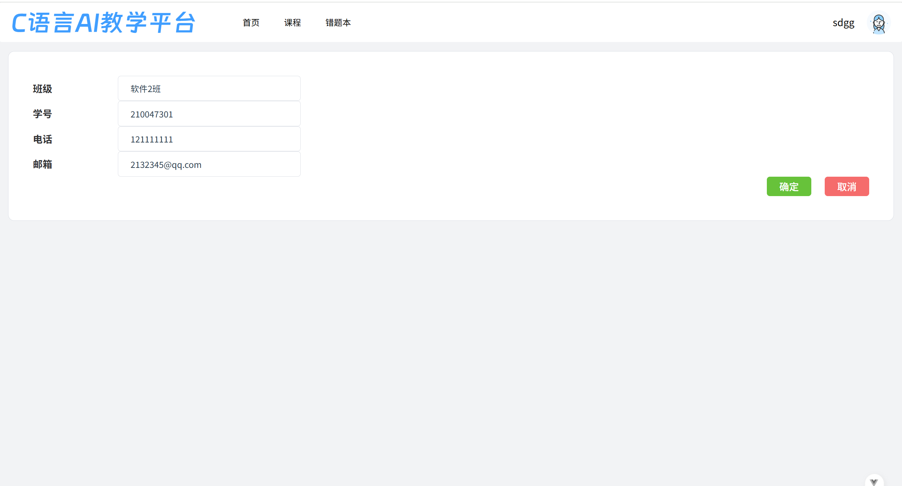

# Vue 3 + Vite c语言教学管理系统前台项目

## 项目简介

本项目是一个基于Vue 3 +
Vite构建的C语言教学管理系统前端项目，旨在为学生提供便捷的C语言学习体验。系统包含课程学习、知识点练习、错题管理等功能模块。项目已适配移动端，提供良好的跨设备使用体验。

## 技术栈

- 前端框架：Vue 3
- 构建工具：Vite
- UI组件库：Element Plus
- 状态管理：Pinia
- 路由管理：Vue Router
- 代码高亮：highlight.js
- Markdown解析：marked

## 项目启动步骤

1. `pnpm install` 安装依赖
2. `pnpm dev` 运行开发服务器

## 其他命令

1. `pnpm lint` 代码检查
2. `pnpm build` 打包生产环境代码
3. `pnpm preview` 预览打包后的代码

## 项目结构

```plaintext
src
├── api/                     # API接口相关文件
│   ├── aiTalk.js            # AI对话接口
│   ├── chapters.js          # 章节相关接口
│   ├── home.js              # 首页相关接口
│   ├── notes.js             # 笔记相关接口
│   ├── question.js          # 题目相关接口
│   └── user.js              # 用户相关接口
├── assets/                  # 静态资源
│   ├── fonts/               # 字体文件
│   ├── images/              # 图片资源
│   └── vue.svg              # Vue logo
├── directives/              # 自定义指令
├── hooks/                   # hoosk函数
├── components/              # 公共组件
│   ├── CircleProgress.vue   # 圆形进度条组件
│   ├── HeaderCm.vue         # 头部组件
│   ├── LButton.vue          # 按钮组件
│   ├── MainCm.vue           # 主内容组件
│   ├── Pagination.vue       # 分页组件
│   ├── Stars.vue            # 评分组件
│   ├── SubHeader.vue        # 子头部组件
│   ├── Tag.vue              # 标签组件
│   └── problemViewDot.vue   # 问题视图点组件
├── main.js                  # 项目入口文件
├── router/                  # 路由配置
│   └── index.js             # 路由配置文件
├── stores/                  # 状态管理
│   ├── index.js             # 状态管理入口
│   └── modules/             # 模块化状态管理
│       ├── counter.js       # 计数器模块
│       └── user.js          # 用户模块
├── styles/                  # 样式文件
│   ├── highlight.scss       # 代码高亮样式
│   ├── index.scss           # 主样式文件
│   ├── reset.scss           # 重置样式
│   └── variables.scss      # 变量定义
├── utils/                   # 工具函数
│   ├── aiAPI/               # AI相关工具
│   │   └── zhipuConfig.js   # 智谱AI配置
│   ├── aiRequest.js         # AI请求工具
│   ├── dateUtils.js         # 日期处理工具
│   ├── request.js           # 请求工具
│   └── requestNode.js       # Node请求工具
└── views/                   # 页面视图
    ├── 404/                 # 404页面
    ├── cources/             # 课程页面
    ├── errorquestion/       # 错题页面
    ├── exercise/            # 练习页面
    ├── home/                # 首页
    ├── knowledge/           # 知识点页面
    ├── login/               # 登录页面
    ├── my/                  # 个人中心页面
    ├── notes/               # 笔记页面
    ├── question/            # 题目页面
    ├── result/              # 结果页面
    ├── sametypeResult/      # 同类题目结果页面
    └── study/               # 学习页面
```

## 主要功能

- 视频课程学习
- 知识点练习
- 错题收集与复习
- 学习进度跟踪
- 笔记管理
- 移动端适配：支持手机、平板等设备

## 开发环境配置

- Node.js版本：>=16.0.0
- pnpm版本：>=8.0.0

## 项目构建

- 开发环境：`pnpm dev`
- 生产环境：`pnpm build`
- 测试环境：`pnpm build:test`

## 代码规范

- ESLint：用于JavaScript/TypeScript代码检查
- Prettier：用于代码格式化

## 项目依赖

- 详见`package.json`文件

## 项目截图（pc端）

### 登录页



### 首页



### 课程列表页



### 知识点详情页



### 答题页



### 题目解析页



### 笔记页



### 错题页



### 个人中心页



## 贡献指南

1. Fork项目
2. 创建新的功能分支
3. 提交代码变更
4. 创建Pull Request
